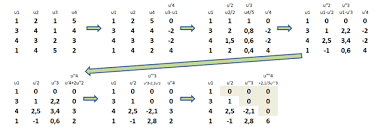

### Numerical resolution of linear equation

#### Table of contents
- [Gauss](#Gauss)
- [Gauss-Jordan](#Gauss-Jordan)
- [Gauss-Seidel](#Gauss-Seidel)
- [Decompostion of LU](#LU)
- [Choleski](#Choleski)
- [Jaccobi](#Jaccobi)
- [Invert of matrix](#InvertMat)
- [Decomposition](#Decomposition)

#### Gauss 
    - Algorithm
        

#### Gauss-Jordan
    - Algorithm

#### Gauss-Seidel
    - Algorithm

#### LU
    - Algorithm

#### Choleski
    -Algorithm

#### InvertMat
    -Algorithm

#### Decomposition
    -Algorithm
